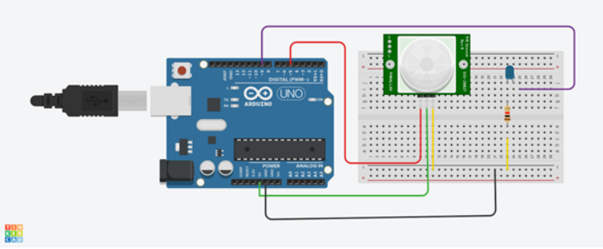

# Buzzer_alarm_system

## Overview
This project demonstrates a simple Buzzer Alarm System using a Passive Infrared (PIR) sensor. The system detects motion and triggers a buzzer alarm when motion is detected. This can be used for security purposes or any motion detection applications.

## Components Required
- PIR Sensor (HC-SR501)
- Buzzer
- Arduino Uno
- Jumper Wires
- Breadboard

## Circuit Diagram
1.Circuit Diagram 
 

2.Our circuit 

## Setup Instructions
1. **Connect the PIR Sensor to Arduino:**
   - VCC to 5V
   - GND to GND
   - OUT to Digital Pin 2

2. **Connect the Buzzer to Arduino:**
   - Positive pin to Digital Pin 8
   - Negative pin to GND

## How to Run the Project

Assemble the Circuit 
Follow the circuit diagram to connect the components. 
Upload the Code 
Connect the Arduino to your computer. 
Open the Arduino IDE. 
Copy the code into the Arduino IDE. 
Select the correct board and port from the Tools menu. 
Click the upload button. 

## Test the System:

Once the code is uploaded, the system will start detecting motion.
When motion is detected, the buzzer will sound, and a message will be printed on the Serial Monitor.

## Acknowledgements
This project was inspired by various online tutorials and resources on using PIR sensors with Arduino.
